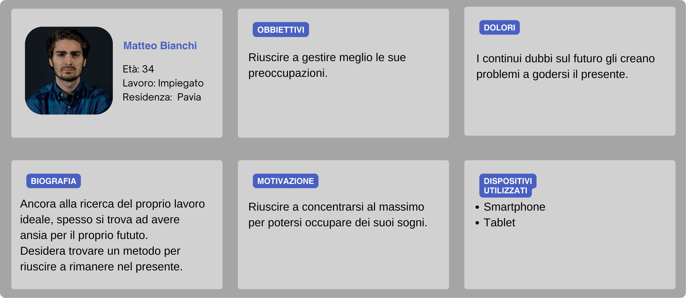

{width=100px height=100px}

# Torna con i piedi per terra
Tecniche di grounding nel quotidiano

## Introduzione
Il progetto tratta della realizzazione di un libro di esercizi riguardante le tecniche di grounding, il formato sarà un ebook ma per facilitare vari tipi di apprendimento avrà integrati al suo interno sia file audio che dei contenuti interattivi.
Questo sarà possibile tramite il formato epub3 e l'aiuto di Sigil per la gestione dei vari file.  
Nel flusso documentale si presterà particolare attenzione alla raccolta e creazione di contenuti veritieri e senza Copyright, creare una struttura per rendere il libro il più facilmente fruibile e fare in modo che la grafica rispetti gli standard di accessibilità.

## Ideazione
Al giorno d'oggi per molte persone risulta difficile rimanere con la mente nel presente sia per i costanti stimoli a cui siamo sottoposti in ogni momento, che per lo stress che si può incontrare nella vita di tutti i giorni.  
L'obbiettivo del mio progetto è creare uno strumento facilmente consultabile in ogni momento che suggerisca vari esercizi che possono aiutare a calmare la mente.

### Tema
Il prodotto dovrà essere un breve manuale riguardante le tecniche di grounding e dovrà comprendere vari esercizi, realizzabili quasi in ogni momento, per ogni tipologia, dovrà spiegare brevemente cos'è e la sua utilità per poi passare ad elencare i vari esercizi con annessa una spiegazione e, nel caso, il necessario per svolgere l'esercizio (_Esempio_: un'audioguida)

### Destinatari
Il progetto è pensato principalmente per persone con problemi a rimanere radicati nel presente, che sia per fattori di stress interni che esterni.
#### Personas

#### Scenari d'uso
_Scenario 1:_ Lettura lineare del libro
1. L'utente apre l'eBook
2. Legge il libro in modo lineare
3.  
    a. L'utente può scegliere se provare gli esercizi durante la lettura  
    b. L'utente può leggerli tutti e poi scegliere che esercizi provare

_Scenario 2:_ Scelta di un esercizio
1. L'utente apre l'eBook
2. Seleziona l'esercizio che vuole effettuare dall'indice
3. Legge la spiegazione l'esercizio
4. L'utente esegue l'esercizio
5.  
    a. Se l'utente si ritiene soddisfatto potrà chiudere l'eBook  
    b. l'utente può tornare al punto 2. e scegliere un nuovo esercizio  

_Scenario 3:_ Utilizza dell'audioguida per l'esercizio
1. L'utente apre l'eBook
2. Seleziona l'esercizio che vuole effettuare dall'indice
3. Attiva l'audioguida che spiegherà l'esercizio
4. L'utente esegue l'esercizio
5.  
    a. Se l'utente si ritiene soddisfatto potrà chiudere l'eBook  
    b. l'utente può tornare al punto 2. e scegliere un nuovo esercizio

### Requisiti di accettazione
Per gli standard di accettazione controlleremo quelli di EPUB Accessibility 1.1 di W3C per le pubblicazioni ePub.
Sfruttando ePub3 potremo anche avere, non solo un tipo di lettura non lineare, ma potremo anche inserire elementi interattivi e multimediali che possano aiutare l'utente ad una migliore fruizione con audio e/o video; avere una guida che spieghi vocalmente un esercizio potrebbe essere utile all'utente quando lo esegue le prime volte o nel caso prediliga l'apprendimento uditivo.  
Fornendo audio/video e testo in un unico prodotto sarà più facile sfruttare tutte le risorse disponibili senza dover aprire e chiudere diverse applicazioni. 

### Canali di distribuzione
La pubblicizzazione più semplice ed efficace per il prodotto sarebbe quella tramite social, grazie ai quali si reindirizzerà ad un sito esterno per un eventuale vendita.
Questo perché tramite social network sarà possibile entrare in contatto anche con persone che magari solitamente non leggono eBook ma che possono essere interessati da qualcosa di più semplice interesse, oltre che a poter trovare più facilmente community appassionate di self-help e salute mentale.  
Con lo standard scelto, sarà necessario usare il fromato .epub in modo da che sia accessibile da più tipi di dispositivi.
Il progetto si cercherà di essere il più familiare e comprensibile all'utente imitando un normale libro di esercizi, questo per cercare di evitare frustrazioni durante l'utilizzo e uno stile più informale in modo da non spaventare il lettore con termini troppo complessi.  
La grafica del progetto avrà:
- una palette con dei toni naturali e forme rotonde in modo da avere un effetto rilassante,
- un font accessibile per chi ha la dislessia,
- un'interlinea tale da non avere il testo troppo ravvicinato,
- chiara divisione tra i vari esercizi in modo da non causare confusione.

## Processo di Produzione

### Acquisizione dei contenuti
Le fonti utilizzate per i contenuti informatici di questo prodotto, verranno da vari articoli e pubblicazioni sostenute da medici e/o pubblicate da fonti attendibili in modo da evitare informazioni errate.
Anche se possono essere coperte da copyright, essendo questo un progetto scolastico e per usi educativi no-profit, l'utilizzo di queste fonti ricade nel Fair Use; in caso non lo fosse sarebbe necessario citare e pagare i diritti sulle fonti utilizzate.  
In caso sia necessario tradurre dei contenuti dall'inglese all'italiano sfutterò il sito DeepL, per poi revisionare e correggere manualmente il risultato.
Per i contenuti grafici invece verranno sfruttati fonti libere da vari siti web.
Infine i contenuti audio verranno generati automaticamente.

### Gestione documentale
#### Raccolta e creazione dei contenuti
```mermaid
flowchart LR
  n{{"Decisione<br>&nbsp;argomenti"}} --> A1("Raccolta <br>fonti")
  A1 --> A2(["Controllo<br> fonti"])
  C1("Bozza <br> struttura eBook") --> D1("Bozza <br> del testo")
  D1 --> D2(["Creazione <br> testo completo"]) & E1("Raccolta <br> contenuti grafici")
  A2 --> B1(["Creazione <br> Bibliografia"]) & C1
  E1 --> F1(["Creazione copertina"]) & F2(["Creazione palette <br>accessibile"]) & F3(["Creazione <br>elementi interattivi"])
```
#### Strutturazione dei contenuti 
```mermaid
flowchart LR
  n1{{"Bozza della struttura"}} --> A("Divisione capitoli")
  n2{{"Testo completo"}} --> A & C(["Creazione<br>elenco <br>degli esercizi"])
  n2 -- Controlli --> n3(("Controllo <br> ortografico")) & n4(("Controllo<br>punteggiatura"))
  A --> B("Divisione in eventuali <br> sottocapitoli")
  B --> E(["Creazione indice"]) --> G("Inserimento link interni")
  C --> D("Inserimento elementi interattivi") & E
  D --> F(("Revisione<br> corretto <br>funzionamento"))
``` 

#### Applicazione dello stile grafico 
```mermaid
flowchart LR
  A(["Creazione <br> fogli di stile <br> basilari"]) --> B("Inserimento <br> font scelto")
  B --> C("Inserimento<br>immagini")
  C --> D("Sistemare <br> impaginazione <br>paragrafi") & E(["Creazione testi<br>&nbsp;alternativi"])
  D --> F("Modifiche <br>estetiche")
  F --> G(("Verifica dei <br>requisiti di <br>accessibilità")) & H(("Convalida <br>fogli di stile <br>con W3C"))

``` 
#### Creazione formato di distribuzione 
```mermaid
flowchart LR
  C("Creazione <br>file .NCX") --> B("Definizione dei <br>metadati descrittivi")
  B --> A(("Controllo <br>epub3<br>&nbsp;ben formato"))
  A --> Z("Compilazione del documento")
``` 

### Tecnologie adottate
#### All'interno del progetto

| Tecnologia         	     | Funzionalità all'interno del progetto                                                                                           |
|----------------------------|---------------------------------------------------------------------------------------------------------------------------------|
| Sigil           	         | Creazione e gestione dei file necessari per un eBook epub3.  Rende disponibili delle automazioni per la gestione di Metadati, link di ipertesto, convalidazione fogli di stile, riformattazione HTML e controllo di epub ben formato. 	|
| XHTML           	         | Necessario per la struttura base.                                                                                               |
| JavaScript                 | Utilizzato per gli elementi interattivi all'interno del progetto                                                                |
| CSS            	         | Utilizzato per la formattazione e le parti garfiche                                                                             |
| Venngage                   | Utilizzato per la creazione di palette di colori conformi alle WCAG 2.1 AA e basate su un rapporto di contrasto di 4,5:1.       |
| Canva           	         | Utilizzato per la creazione della copertina sfruttando i modelli esistenti.                                                     |
| ttsmaker                   | Utilizzato per la trasformazione da testo ad audio.                                                                             |
| ACE  (plugin per Sigil) | Controlla l'accessibilità dell'ebook e riporta eventuali violazioni rispetto alle specifiche di accessibilità di WCAG ed eEPUB. |

#### Per la documentazione

| Tecnologia        	    | Funzionalità all'interno della documentazione                    	                |
|---------------------------|-----------------------------------------------------------------------------------|
| GitHub          	        | Gestione del flusso di produzione                      	                        |
| Canva                   	| Utilizzato per la creazione della copertina sfruttando i modelli esistenti. 	    |
| Mermaid          	        | Creazione di diagrammi di flusso, facilitata anche dall'editor online    	        |
| Markdown Table Generator 	| Creazione di tabelle facilitata                       	                        |
| MyBib           	        | Generazione di bibliografia e sitografia facilitata             	                |
| Visual Paradigm Online    | Utilizzato per le versioni ASIS e TOBE del flusso                                 |

### Esecuzione del flusso
[Nel repository linkato](https://github.com/borlini123/Editoria-Digitale-Relazione-2023-2024) si può trovare tutto ciò che è relativo al progetto, alla sua realizzazione e alla creazione della relazione.

## Valutazione dei risultati raggiunti

### Valutazione del flusso di produzione
Non avendo utilizzato un programma dotato di strumenti appositi per la creazione e gestione dei documenti, sicuramente si è persa uniformità ma, utilizzando vari strumenti sparsi, è stato possibile risparmiare un po' di tempo ed errori sintattici.
Anche grazie all'editor di Sigil, e possibilità fornita di aggiustare il codice automaticamente, è stato possibile rendere più immediata la correzione di errori di codifica anche se purtroppo, data la mancanza del dizionario italiano nel programma, l'individuazione e correzione di errori di ortografia ha necessitato di più attenzioni. Infine, il plugin ACE ha permesso un controllo più facile, veloce ed accurato per il rispetto degli standard di accessibilità.  
L'utilizzo di epub3 permette di raggiungere sia computer, che smartphone ma anche diversi brand di ebook; in questo modo una più ampia quantità di utenti può utilizzare il prodotto facilmente. Inoltre essendo un unico file è possibile renderlo scaricabile su quasi ogni piattaforma.  
Grazie ai contenuti interattivi è stato possibile dare un ulteriore aiuto all'utente, fornendo degli spunti nel caso ne abbia necessità.

### Confronto con lo stato dell'arte
[//]: # (Può anche essere utile confrontare una versione ASIS del flusso di gestione, senza la tecnologia o le innovazioni proposte, e una TOBE che include la tecnologia e le innovazioni proposte dallo studente.)
#### Schema flusso di gestione ASIS  

#### Schema flusso di gestione TOBE  

 
I due flussi non sembrano molto differenti al primo sguardo, ma prestando attenzione, nella versione ToBe diversi passaggi sono stati automatizzati e solo in caso di errori è necessario un intervento manuale, risparmiando così diverso tempo. Inoltre nella versione ASIS l'audio è separato dall'ebook come è comune fare solitamente.

### Limiti emersi
Il limite principale emerso è stato cercare di utilizzare tecnologie disponibili gratuitamente.
Infatti molte risorse che avrebbero potuto permettere di generare tramite AI parte della documentazione o contenuti multimediali erano dietro paywall e le alternative erano di qualità molto bassa o inesistenti, facendo diventare il lavoro manuale l'unica possibile scelta.
Due esempi che incapsulano bene questo problema sono la creazione delle personas e la trasformazione del testo in audio. Nel primo caso avevo trovato un [generatore gratuito di User personas](https://userpersona.dev/) che partiva da una descrizione per generarle, ma una volta inserito un prompt era possibile generarne una sola e anche cambiando leggermente le differenze erano praticamente insignificanti; guardando meglio al sito si veniva rediretti ad un altro sito dove c'era il rpodotto completo a pagamento.
Nel secondo caso invece, i vari generatori di audio da testo o permettevano di tradurre solo brevi paragrafi, o fornivano audio di bassa qualità con la possibilità di pronunciare correttamente solo una lingua per volta. Il [sito che ho utilizzato](https://ttsmaker.com/) alla fine è stato quello che più ritenevo bilanciato, però ciò ha reso molto tediosa la trasformazione dato che le pause per la punteggiatura andavano inserite a mano e il testo trasformabile massimo 1000 caratteri alla volta (compresi quelli per inserire le pause).
Infine, una aspetto che ha reso la realizzazione del progetto più difficoltosa, sono la scarsa quantità di tutorial ed informazioni riguardanti l'editor di Sigil; spesso le fonti disponibili erano di circa 10 anni fa, quindi non aggionate, oppure non molto esplicative. 

## Conclusioni
Gli obbiettivi dei casi d'uso sono stati ottenuti anche se in modo abbastanza basilare e poco rifinito, soprattutto per ciò che riguarda la trasformazione del testo in audio. In compenso, l'integrazione dei contenuti interattivi è stata ottima e, sebbene la scarsa quantità di tutorial a riguardo, secondo me potrebbero essere un ottimo strumento sia per l'apprendimento che per aiutare nell'immersione di racconti di narrativa.  
Sicuramente sono disponibili strumenti migliori e più professionali, ma ad un costo che una persona indipendente magari non è disposta a spendere; nonostante ciò un risultato soddisfacente, sebbene necessitando più tempo, è possibile ottenerlo.

## Bibliografia e sitografia
[@canva,@mermaid,@mtg,@my_bib,@vpo,@chevalier_2015,@fisher_1999,@healthline,@choosing_therapy,@daisyconsortium_epub,@daisyconsortium_ace,@sigil,@venngage,@ttsmaker,@pexels_flatlays,@pexels_floral,@pexels_food]
